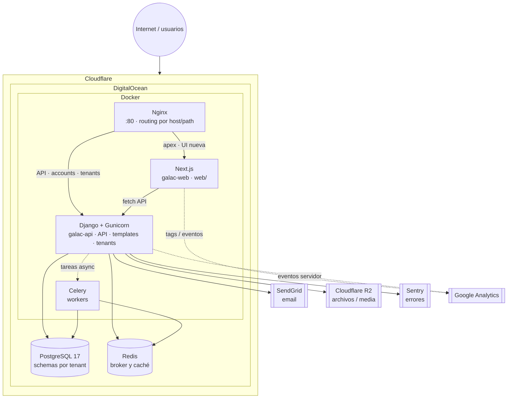

# Arquitectura

> **Nuevo en el equipo:** el itinerario de 16 horas y el mapa de documentación están en [ONBOARDING.md](ONBOARDING.md).

## Tabla de contenidos

1. [Visión general](#1-visión-general)
2. [Multi-tenancy](#2-multi-tenancy)
3. [Flujo de un request](#3-flujo-de-un-request)
4. [Capas de la aplicación](#4-capas-de-la-aplicación)
5. [Middleware pipeline](#5-middleware-pipeline)
6. [Modelo de datos](#6-modelo-de-datos)
7. [Autenticación y autorización](#7-autenticación-y-autorización)
8. [Almacenamiento de archivos](#8-almacenamiento-de-archivos)
9. [Tareas asíncronas](#9-tareas-asíncronas)
10. [Observabilidad](#10-observabilidad)

---

## 1. Visión general

Galac es un ERP multi-tenant donde cada empresa (tenant) opera con datos
completamente aislados. La arquitectura se basa en:

### Diagrama de infraestructura (visión producción)

Relación con el diagrama clásico (Cloudflare → DO → contenedores): el tráfico entra por **Cloudflare**, el origen suele ser una VM en **DigitalOcean** con **Docker** (`nginx`, `nextjs`, `web`/Django). **PostgreSQL** y **Redis** suelen ser **gestionados** o servicios aparte (no van en `docker-compose.prod.yml` mínimo). **Celery** puede ser otro contenedor/servicio en la misma VM o en otro host.



> En **desarrollo**, los assets de plantillas Django se generan con `npm run build` o `watch:css` / `watch:js` en la raíz del repo (Tailwind CLI + esbuild); no se muestran en el diagrama.

### Diagrama textual (detalle de rutas Nginx)

```
                         ┌─────────────────────────────────────────┐
                         │              Internet                   │
                         │   (Cloudflare TLS hacia el origen :80)  │
                         └──────────────────┬──────────────────────┘
                                            │
                         ┌──────────────────▼──────────────────────┐
                         │          Nginx (reverse proxy)            │
                         │  Dominio apex: / → Next.js :3000          │
                         │  /onboarding/, /galac-admin/… vía reglas │
                         │  /api/, /accounts/, subdominios tenant    │
                         │       → Django :8000                      │
                         │  /healthz → 200 OK                        │
                         └──────────────┬───────────────┬────────────┘
                                        │               │
                    ┌───────────────────▼───┐   ┌───────▼────────────────┐
                    │ Next.js (web/)        │   │ Django / Gunicorn     │
                    │ App Router, UI nueva  │   │ WSGI, templates HTML,  │
                    │ consume APIs Django   │   │ django-tenants        │
                    └───────────────────────┘   │  ┌─────────┐ ┌──────┐ │
                                                │  │ public  │ │tenant│ │
                                                │  │ schema  │ │schema│ │
                                                │  └─────────┘ └──────┘ │
                                                └───────────┬───────────┘
                                                            │
                         ┌──────────────────────────────────▼────────────┐
                         │         PostgreSQL 17                    │
                         │   ┌────────┐ ┌────────┐ ┌────────┐     │
                         │   │public  │ │emp_abc │ │emp_xyz │     │
                         │   │schema  │ │schema  │ │schema  │     │
                         │   └────────┘ └────────┘ └────────┘     │
                         └─────────────────────────────────────────┘
                                            │
              ┌─────────────────────────────┼──────────────────────┐
              │                             │                      │
    ┌─────────▼─────────┐     ┌─────────────▼──────┐    ┌─────────▼────────┐
    │   Redis            │     │ Cloudflare R2       │    │    Sentry         │
    │   (Celery broker)  │     │ (media/archivos)    │    │ (monitoreo)       │
    └────────────────────┘     └────────────────────┘    └──────────────────┘
```

### Componentes principales

| Componente        | Rol |
|-------------------|-----|
| **Nginx**         | Reverse proxy: enrutamiento por host y path (apex → Next.js; APIs y tenants → Django), healthcheck `/healthz` |
| **Django**        | Backend principal: REST/API, vistas HTML (templates), auth, multi-tenant, admin |
| **Next.js (`web/`)** | Frontend moderno (App Router): flujos nuevos en el dominio público y rutas proxeadas según `docker/nginx/*.conf.template` |
| **PostgreSQL**    | Base de datos; un schema por tenant (`django-tenants`) |
| **Redis**         | Broker de Celery y caché en desarrollo |
| **Celery**        | Tareas asíncronas |
| **Cloudflare R2** | Media/archivos en producción |
| **Node (raíz)**   | Build de CSS/JS para templates Django: Tailwind CLI + esbuild (`npm run build` → `static/`) |

Las rutas exactas (qué va a Next vs Django) viven en `docker/nginx/dev.conf.template` y `docker/nginx/prod.conf.template`.

---

## 2. Multi-tenancy

### Estrategia: Schema-based isolation

Usamos `django-tenants` con aislamiento a nivel de **schema de PostgreSQL**.
Cada empresa tiene su propio schema con tablas independientes.

```
PostgreSQL
├── public (schema)
│   ├── accounts_user         ← Usuarios (compartidos)
│   ├── company_company       ← Empresas/tenants
│   ├── company_domain        ← Dominios de cada tenant
│   ├── teams_teammember      ← Membresías usuario↔empresa
│   ├── teams_role            ← Roles RBAC por empresa
│   ├── teams_invitation      ← Invitaciones pendientes
│   ├── currency_currency     ← Monedas (VES, USD, EUR)
│   ├── currency_exchangerate ← Tasas de cambio
│   ├── onboarding (sin modelos, solo lógica)
│   └── ...
│
├── empresa_abc (schema)      ← Tenant "ABC Corp"
│   ├── inventory_inventoryitem
│   ├── inventory_warehouse
│   ├── inventory_warehousestock
│   ├── inventory_price
│   ├── inventory_inventorytransaction
│   ├── inventory_inventorytransactionline
│   ├── dashboard_* (widgets, etc.)
│   └── simple_history_historicalrecord
│
├── empresa_xyz (schema)      ← Tenant "XYZ Inc" (datos completamente separados)
│   ├── inventory_inventoryitem
│   └── ...
```

### Shared vs Tenant apps

La configuración en `config/settings.py` define qué apps van en cada nivel:

```python
SHARED_APPS = (
    "django_tenants",
    "django.contrib.admin",
    "django.contrib.auth",
    # ...
    "apps.accounts",      # Usuarios
    "apps.company",       # Empresas/tenants
    "apps.currency",      # Monedas y tasas de cambio
    "apps.teams",         # Membresías y roles
    "apps.onboarding",    # Flujo de creación de empresa
    "apps.geo",           # Datos geográficos
    "apps.galac_admin",   # Admin de la plataforma
)

TENANT_APPS = (
    "simple_history",
    "apps.dashboard",     # Dashboard por empresa
    "apps.inventory",     # Inventario (aislado por empresa)
)
```

### Resolución del tenant

```
Request: https://empresa-abc.galac.com/inventory/items/
                 ▲
                 │
    django-tenants extrae el subdominio "empresa-abc"
                 │
                 ▼
    Busca en company_domain → encuentra Company(slug="empresa-abc")
                 │
                 ▼
    SET search_path TO empresa_abc, public;
                 │
                 ▼
    Ahora TODOS los queries ORM van al schema "empresa_abc"
    (InventoryItem.objects.all() solo retorna ítems de esa empresa)
```

### URLs públicas vs tenant

| Dominio                           | URL Config              | Schema   |
|-----------------------------------|-------------------------|----------|
| `galac.com` (sin subdominio)      | `config.urls_public`    | `public` |
| `empresa.galac.com` (subdominio)  | `config.urls`           | `empresa`|

---

## 3. Flujo de un request

### Request a un tenant (ejemplo: listar ítems)

```
1. Browser: GET https://empresa.galac.com/inventory/items/
2. Nginx: proxy_pass → Django:8000
3. TenantMainMiddleware: subdominio "empresa" → SET search_path = empresa, public
4. SecurityMiddleware → WhiteNoise (static) → Session → CSRF → Auth
5. AccountMiddleware (allauth)
6. InvitationMiddleware: ¿tiene cookie de invitación? → procesar
7. OnboardingMiddleware: ¿usuario sin empresa? → redirect a onboarding
8. TenantAccessMiddleware: ¿usuario es miembro de este tenant? → 403 si no
9. URL resolver: /inventory/items/ → InventoryItemListView
10. TenantPermissionMixin: ¿tiene permiso "inventory.view_items"? → 403 si no
11. View: InventoryItem.objects.filter(...) → query al schema "empresa"
12. Template: renderizar HTML con datos
13. Response: 200 OK + HTML
```

### Request al dominio público (ejemplo: onboarding)

```
1. Browser: GET https://galac.com/onboarding/step-1/
2. Nginx: proxy_pass → Django:8000
3. TenantMainMiddleware: sin subdominio → schema "public"
4. Middleware chain...
5. URL resolver (urls_public): /onboarding/step-1/ → OnboardingStep1View
6. View: renderizar formulario de creación de empresa
7. Response: 200 OK + HTML
```

---

## 4. Capas de la aplicación

Cada app sigue una separación de responsabilidades consistente:

```
apps/<modulo>/
├── models.py          ← Modelos de datos (solo definición + propiedades simples)
├── services/          ← Lógica de negocio (crear, actualizar, eliminar)
│   ├── item.py        ← ItemService.create(), ItemService.update()
│   ├── transaction.py ← TransactionService.create_entry(), .create_exit()
│   └── ...
├── selectors/         ← Consultas de lectura (filtros, búsquedas, reportes)
│   ├── item.py        ← ItemSelector.list(), ItemSelector.search()
│   ├── transaction.py ← TransactionSelector.list(), .get_by_id()
│   └── ...
├── views/             ← Vistas HTTP (delegan a services/selectors)
│   ├── item.py        ← InventoryItemListView, InventoryItemCreateView
│   └── ...
├── api/               ← API REST (serializers + views JSON)
│   ├── serializers.py
│   ├── views.py
│   └── urls.py
├── forms.py           ← Formularios Django (validación de entrada)
├── urls.py            ← Rutas URL del módulo
├── templates/         ← Templates HTML (Django templates + HTMX)
├── tests/             ← Tests organizados por capa
│   ├── test_models.py
│   ├── test_services.py
│   ├── test_views.py
│   ├── test_forms.py
│   ├── test_api.py
│   └── conftest.py
└── migrations/        ← Migraciones de base de datos
```

### Flujo de datos

```
Request HTTP
    │
    ▼
  URL Router → View/API View
                  │
          ┌───────┼───────┐
          ▼               ▼
    Form (validar)    Serializer (validar)
          │               │
          ▼               ▼
      Service (lógica de negocio)
          │
          ▼
      Model (persistencia)
          │
          ▼
     Selector (lectura/consultas)
          │
          ▼
    Template / JSON Response
```

**Reglas:**
- Las **views** nunca acceden directamente a los modelos para escritura; siempre pasan por un **service**.
- Los **selectors** encapsulan queries complejos y evitan poner lógica de consultas en las views.
- Los **models** solo definen estructura, propiedades calculadas y managers simples.
- Los **services** contienen toda la lógica de negocio (validaciones, efectos secundarios, transacciones).

---

## 5. Middleware pipeline

El orden del middleware es crítico. Cada request pasa por esta cadena:

```python
MIDDLEWARE = [
    # 1. Multi-tenancy: resuelve el tenant desde el subdominio
    "django_tenants.middleware.main.TenantMainMiddleware",

    # 2. Seguridad y headers
    "django.middleware.security.SecurityMiddleware",
    "whitenoise.middleware.WhiteNoiseMiddleware",        # Archivos estáticos

    # 3. Sesión y autenticación
    "django.contrib.sessions.middleware.SessionMiddleware",
    "django.middleware.common.CommonMiddleware",
    "django.middleware.csrf.CsrfViewMiddleware",
    "django.contrib.auth.middleware.AuthenticationMiddleware",
    "django.contrib.messages.middleware.MessageMiddleware",
    "django.middleware.clickjacking.XFrameOptionsMiddleware",

    # 4. Third-party
    "allauth.account.middleware.AccountMiddleware",      # django-allauth
    "simple_history.middleware.HistoryRequestMiddleware", # Auditoría
    "hijack.middleware.HijackUserMiddleware",             # Impersonar usuarios

    # 5. Lógica de negocio (orden importa)
    "apps.teams.middleware.InvitationMiddleware",         # Invitaciones por cookie
    "apps.onboarding.middleware.OnboardingMiddleware",    # Redirect a onboarding
    "apps.company.middleware.TenantAccessMiddleware",     # Verificar membresía
]
```

### Detalle de middlewares propios

| Middleware | Responsabilidad |
|------------|-----------------|
| `InvitationMiddleware` | Captura tokens de invitación del querystring, los guarda en una cookie firmada, y redirige usuarios autenticados a la pantalla de decisión |
| `OnboardingMiddleware` | Si el usuario no tiene empresa ni invitación pendiente, lo redirige a `/onboarding/step-1/`. Exime rutas de cuentas, static, API, etc. |
| `TenantAccessMiddleware` | Verifica que el usuario autenticado es miembro del tenant actual. Si no lo es, muestra error 403 |

---

## 6. Modelo de datos

### Diagrama de entidades principales

```
┌──────────────────┐    ┌──────────────────┐    ┌──────────────────┐
│      User        │    │    Company        │    │     Domain       │
│ (accounts)       │───▶│   (company)       │───▶│   (company)      │
│                  │owns│                   │has │                  │
│ email (PK lógico)│    │ name, slug, rif   │    │ domain, is_primary│
│ active_tenant    │    │ owner → User      │    │ tenant → Company │
│ profile_photo    │    │ logo, extra_info  │    │                  │
└──────┬───────────┘    └──────┬────────────┘    └──────────────────┘
       │                       │
       │ ┌─────────────────────┘
       │ │
       ▼ ▼
┌──────────────────┐    ┌──────────────────┐    ┌──────────────────┐
│   TeamMember     │    │      Role        │    │   Invitation     │
│   (teams)        │    │    (teams)       │    │    (teams)       │
│                  │    │                  │    │                  │
│ user → User      │    │ company → Company│    │ email            │
│ company → Company│    │ name             │    │ company → Company│
│ role_ref → Role  │    │ permissions JSON │    │ token (unique)   │
│                  │    │ is_system        │    │ status, expires  │
└──────────────────┘    └──────────────────┘    └──────────────────┘

── Dentro de cada tenant (schema aislado) ──────────────────────────

┌──────────────────┐    ┌──────────────────┐    ┌──────────────────┐
│  InventoryItem   │    │   Warehouse      │    │  WarehouseStock  │
│  (inventory)     │    │  (inventory)     │    │  (inventory)     │
│                  │    │                  │    │                  │
│ name, sku        │    │ name, code       │    │ item → Item      │
│ item_type        │◀───│ is_default       │◀───│ warehouse → WH   │
│ product_line     │    │ is_active        │    │ quantity         │
│ category         │    │                  │    │                  │
└──────┬───────────┘    └──────────────────┘    └──────────────────┘
       │
       │
┌──────▼───────────┐    ┌──────────────────┐
│     Price        │    │ InventoryTx      │
│  (inventory)     │    │ (inventory)      │
│                  │    │                  │
│ item → Item      │    │ warehouse → WH   │
│ price_type       │    │ tx_type (IN/OUT) │
│ amount, currency │    │ reference, notes │
│ ves_amount (fx)  │    │ reversal fields  │
│ fx_rate, fx_date │    │                  │
└──────────────────┘    └──────┬───────────┘
                               │
                        ┌──────▼───────────┐
                        │ TxLine           │
                        │ (inventory)      │
                        │                  │
                        │ transaction → Tx │
                        │ item → Item      │
                        │ quantity         │
                        │ unit_cost, fx    │
                        └──────────────────┘
```

---

## 7. Autenticación y autorización

### Autenticación

- **django-allauth** maneja login, signup, reset de password
- **Email** es el identificador principal (no username)
- **Google OAuth** disponible como método alternativo
- **MFA/FIDO2** soportado vía `allauth.mfa` y `fido2`
- Cookies de sesión compartidas entre subdominios (`.lvh.me` en dev, `.galac.com` en prod)

### Autorización (RBAC)

```
User ──[TeamMember]──▶ Company
                         │
                    role_ref → Role
                                │
                          permissions (JSON)
                                │
                    ┌───────────┼───────────┐
                    ▼           ▼           ▼
              "inventory.   "teams.      "dashboard.
               view_items"   manage"      view"
```

- Cada `Company` tiene `Role` con un JSON de permisos
- `TeamMember` vincula usuario + empresa + rol
- `TenantPermissionMixin` verifica permisos en las views
- `TenantPermissionAPIMixin` hace lo mismo para endpoints API (retorna JSON 403)
- Roles de sistema (`is_system=True`) se crean automáticamente: OWNER, ADMIN, MEMBER

---

## 8. Almacenamiento de archivos

```
Desarrollo (tests)         Producción
┌────────────────┐        ┌────────────────────────┐
│ InMemoryStorage│        │ Cloudflare R2 (S3)     │
│ (sin disco)    │        │ django-storages/boto3  │
└────────────────┘        └────────────────────────┘
```

- **Producción**: Cloudflare R2 vía `django-storages` con backend S3Boto3
- **Tests**: `InMemoryStorage` (no toca disco ni R2)
- **Archivos estáticos**: WhiteNoise (comprimidos y cacheados en producción)
- **Uploads**: logos de empresa, fotos de perfil de usuario

---

## 9. Tareas asíncronas

```python
# config/celery.py
app = Celery("galac")
app.config_from_object("django.conf:settings", namespace="CELERY")
app.autodiscover_tasks()  # busca tasks.py en cada app
```

| Escenario                    | Comportamiento                          |
|------------------------------|-----------------------------------------|
| Con Redis configurado        | Celery worker ejecuta tareas en background |
| Sin Redis (dev local simple) | `CELERY_TASK_ALWAYS_EAGER = True` → síncrono |
| En tests                     | Siempre síncrono (eager)                |

Las tareas se encuentran en los archivos `tasks.py` de cada app (ej. `apps/galac_admin/tasks.py`).

### 9.1 Sincronización automática de tasas BCV

Galac mantiene las tasas de cambio oficiales en el schema **público** (`currency_exchangerate`).
No se precargan en migraciones: se importan desde el sitio del [BCV](https://www.bcv.org.ve/)
mediante una tarea Celery programada y, de forma opcional, desde el panel de administración.

#### Flujo

```
Celery Beat (diario, BCV_SYNC_AT)
        │
        ▼
sync_bcv_historical_rates          ← apps/galac_admin/tasks.py
        │
        ▼
BCVHistoricalRatesService          ← apps/galac_admin/services.py
  .sync_available_history()
        │
        ├── Descarga el XLS trimestral publicado en bcv.org.ve
        ├── Crea monedas faltantes (Currency)
        └── Inserta/actualiza ExchangeRate (source=BCV, quote=VES)
```

En cada ejecución el servicio recorre los trimestres desde el año configurado hasta el
año actual. Los trimestres **ya importados** se omiten; el **trimestre en curso** siempre
se vuelve a procesar para capturar la tasa del día.

#### Programación (Celery Beat)

Definida en `config/settings.py` → `CELERY_BEAT_SCHEDULE`:

| Clave | Tarea | Horario |
|-------|-------|---------|
| `sync_bcv_historical_rates_daily` | `apps.galac_admin.tasks.sync_bcv_historical_rates` | Diario a las `BCV_SYNC_AT` |

| Variable | Descripción | Default |
|----------|-------------|---------|
| `BCV_SYNC_AT` | Hora de ejecución diaria, formato `HH:MM` (24 h) | `16:00` |
| `CELERY_BROKER_URL` | Redis para encolar la tarea | vacío → modo eager (sin Beat real) |
| `CELERY_TIMEZONE` | Zona horaria del schedule | `America/Caracas` (`TIME_ZONE`) |

El horario por defecto (`16:00`) coincide con la publicación habitual de tasas del BCV.
Para cambiarlo, define `BCV_SYNC_AT` en `.env` / `.env.prod` y reinicia `celery_beat`.

#### Infraestructura requerida

La sincronización automática necesita **Redis**, un **worker** y **Beat** activos:

| Entorno | Worker | Beat |
|---------|--------|------|
| Dev (`docker-compose.dev.yml`) | `celery_dev` | `celery_beat` |
| Prod (`docker-compose.prod.yml`) | `celery` | `celery_beat` |

Sin `CELERY_BROKER_URL`, las tareas se ejecutan en el mismo proceso (eager) y **Celery Beat
no programa nada** — útil para desarrollo simple, no para sync diaria en producción.

#### Sincronización manual

Desde **Admin → Monedas → Sync BCV** (Next.js) o la vista legacy en Galac Admin.
Permite elegir rango de años y consultar el estado de la tarea en background.
Si no hay tasas en la BD (instalación nueva), conviene ejecutar un sync manual una vez
o esperar a la primera ejecución programada.

#### Reintentos y logs

- La tarea reintenta hasta **24 veces** con intervalo de **1 hora** ante errores de red/BCV.
- Límite de ejecución: 600 s (soft 540 s).
- Logs en el contenedor del worker: `docker logs -f galac_celery_dev` (dev) o el servicio `celery` (prod).

#### Tests

El schedule se valida en `apps/galac_admin/tests/test_tasks.py`.

---

## 10. Observabilidad

### Sentry

- **Habilitado** cuando `SENTRY_ENABLED=true` (por defecto en producción)
- **Error tracking** con sampling configurable (`SENTRY_SAMPLE_RATE`)
- **Performance tracing** con sampling separado (`SENTRY_TRACES_SAMPLE_RATE`)
- Redacta datos sensibles (headers de autorización, cookies, body del request)
- Excluye rutas de static/favicon del tracing
- Release tag = hash corto del commit de Git

### Logging

```python
LOGGING = build_logging(LOG_LEVEL, DJANGO_LOG_LEVEL)
```

- `LOG_LEVEL`: nivel para código del proyecto (`apps/`)
- `DJANGO_LOG_LEVEL`: nivel para internals de Django
- Formato: `[TIMESTAMP] LEVEL [app_name] message`
- Output: console (stdout) → capturado por Docker logs

### Google Analytics

- Configurable con `GOOGLE_ANALYTICS_MEASUREMENT_ID`
- Inyectado en templates base vía context processor
